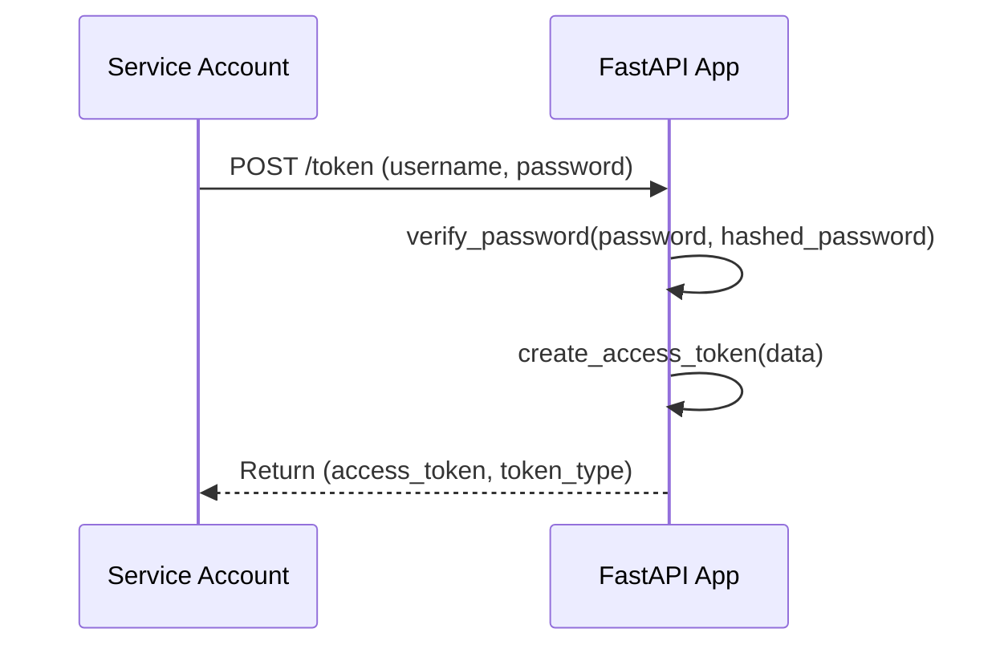
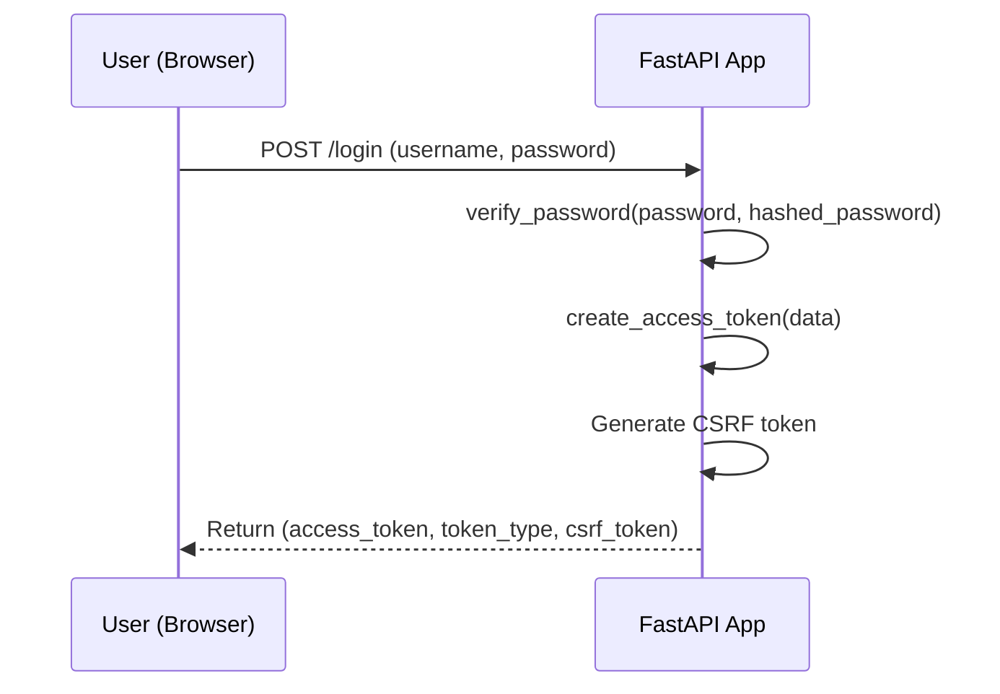
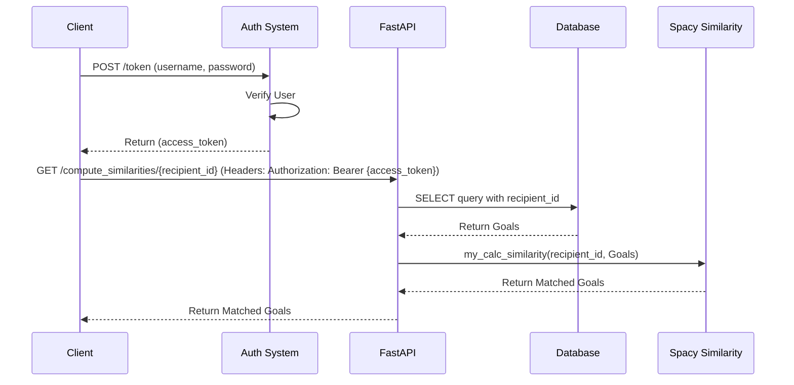

# Data Science API 
## Description
This API is used to enable data scientists to run their models against the platform. Aiding in delivering insights on user activity and other data points.
The first usecase was to use Natural Language Processing to conduct sentiment analysis on goal data. This was done by using the [spaCy](https://spacy.io/) library.

## Usage 
### Authentication



For a Service Account, it sends a POST request to the /token endpoint with its username and password. The FastAPI app verifies the password and creates an access token, which it returns to the Service Account.



For a User using a browser, they would send a POST request to the /login endpoint with their username and password. Like the Service Account, FastAPI verifies the password and creates an access token. However, FastAPI also generates a CSRF (Cross-Site Request Forgery) token and returns all three pieces of information to the User. The CSRF token is used to help prevent cross-site request forgery attacks and would be stored in the user's session. The access token would be stored in the user's browser as a cookie.

### Models



In this diagram:

The Client obtains an access token from the Authentication System.
The Client makes a GET request to the compute_similarities endpoint with the recipient_id and includes the access token in the Authorization header.
The FastAPI app queries the Database using the provided recipient_id and fetches the relevant Goals.
FastAPI app then sends these Goals to the my_calc_similarity function in the Spacy Similarity module.
The Spacy Similarity module calculates the similarities and returns the Matched Goals.
Finally, the FastAPI app returns these Matched Goals to the Client.

## Local Development

### Docker Compose

To integrate with existing local development processes, the API can be run using Docker Compose. This will start the API and a local container and connect via the normal yarn start commands documented in the root README.

```bash
nvm use 16.19.1
yarn docker:start
```

docker-compose.yml uses the data_science.dockerfile to run the container, this container was originally constructed to provided a production ready image for the service(so its a bit overkill for local development). If this begins causing issues, the final build image can be dropped.

### Tilt.dev (Optional)
This can be used to segment the container logging, and extend functionality, like refreshing containers on file changes or manually triggering a container rebuild.

To install tilt run
`brew install tilt`
To start the web service run the following command from the root directory of the project. This should perform a similar function to the docker-compose.yml file up command.
docker-compose commands are replaced with tilt commands.

```bash
# start the service
tilt up

# stop the service
tilt down
```
