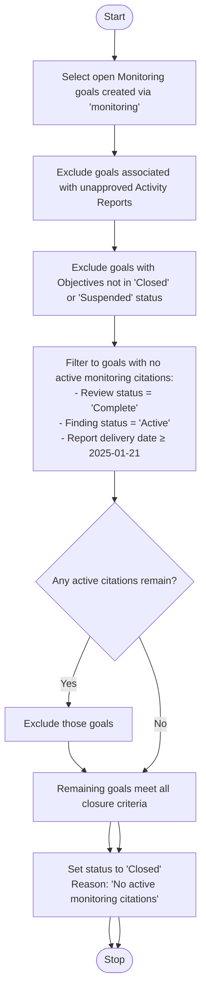

```mermaid
flowchart TD
  Start([Start])
  SelectGoals[Select open Monitoring goals created via 'monitoring']
  ExcludeUnapproved[Exclude goals associated with unapproved Activity Reports]
  ExcludeObjectives[Exclude goals with Objectives not in 'Closed' or 'Suspended' status]
  FilterActive["Filter to goals with no active monitoring citations:<br>- Review status = 'Complete'<br>- Finding status = 'Active'<br>- Report delivery date ≥ 2025-01-21"]
  AnyActive{Any active citations remain?}
  ExcludeRemaining[Exclude those goals]
  Remaining[Remaining goals meet all closure criteria]
  SetStatus["Set status to 'Closed'<br>Reason: 'No active monitoring citations'"]
  Stop([Stop])

  Start --> SelectGoals --> ExcludeUnapproved --> ExcludeObjectives --> FilterActive --> AnyActive
  AnyActive -- Yes --> ExcludeRemaining --> Remaining --> SetStatus --> Stop
  AnyActive -- No --> Remaining --> SetStatus --> Stop
```
