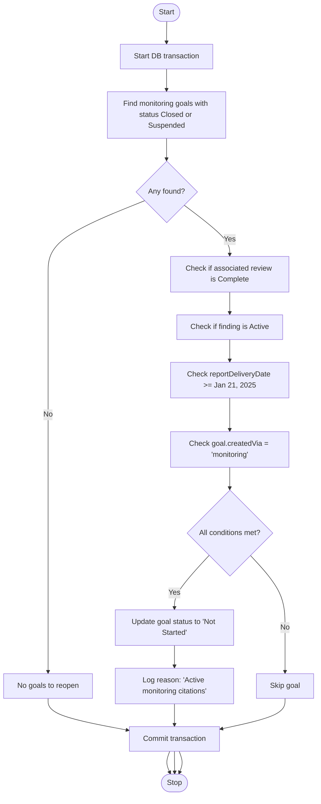

```mermaid
flowchart TD
  Start([Start])
  BeginTxn[Start DB transaction]
  FindGoals[Find monitoring goals with status Closed or Suspended]
  AnyFound{Any found?}
  CheckReview[Check if associated review is Complete]
  CheckFinding[Check if finding is Active]
  CheckDate[Check reportDeliveryDate >= Jan 21, 2025]
  CheckSource[Check goal.createdVia = 'monitoring']
  AllConditions{All conditions met?}
  UpdateStatus[Update goal status to 'Not Started']
  LogReason[Log reason: 'Active monitoring citations']
  SkipGoal[Skip goal]
  NoGoals[No goals to reopen]
  Commit[Commit transaction]
  Stop([Stop])

  Start --> BeginTxn --> FindGoals --> AnyFound
  AnyFound -- No --> NoGoals --> Commit --> Stop
  AnyFound -- Yes --> CheckReview --> CheckFinding --> CheckDate --> CheckSource --> AllConditions
  AllConditions -- Yes --> UpdateStatus --> LogReason --> Commit --> Stop
  AllConditions -- No --> SkipGoal --> Commit --> Stop
```
