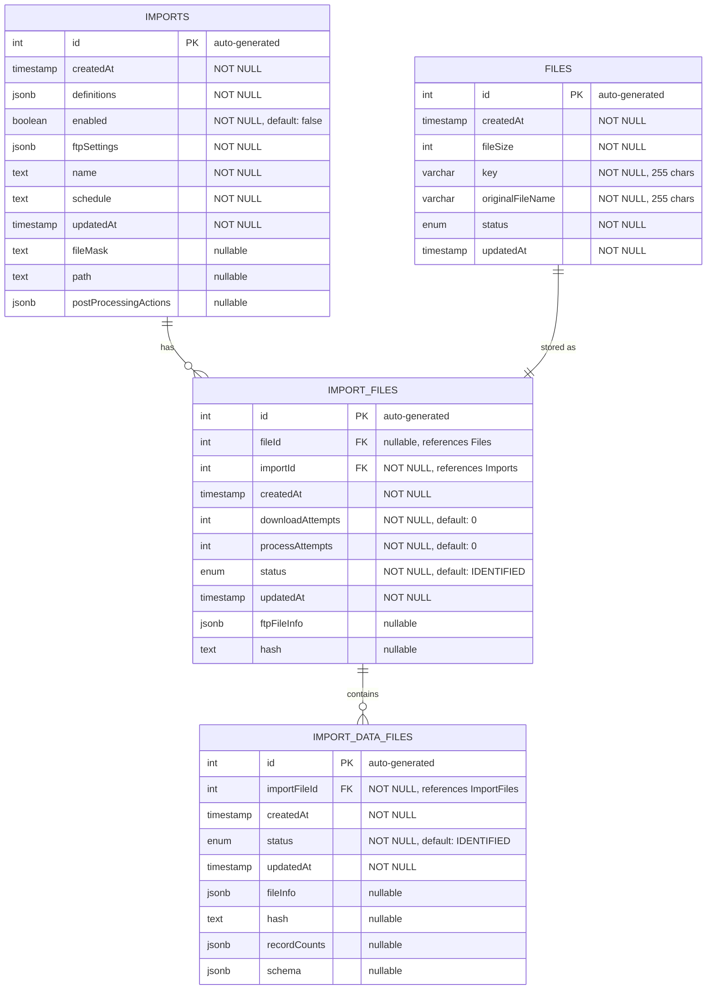

# Import System Entity Relationship Diagram

## Crow's Foot Notation Guide

The relationship lines use industry-standard crow's foot notation:

- `||--o{` = **One-to-many** (zero or more on the many side)
  - Example: One import has zero or more import files
- `||--||` = **One-to-one** (required on both sides)
  - Example: One file is stored as exactly one import file

**Symbol meanings:**
- `||` = Exactly one (required)
- `o|` = Zero or one (optional)
- `}o` = Zero or more (optional, many)
- `}|` = One or more (required, many)

## Field Notation

- **PK** = Primary key
- **FK** = Foreign key
- **"NOT NULL"** = Required field
- **"nullable"** = Optional field
- **"auto-generated"** = Database-generated value
- **"default: value"** = Default value

## About This Diagram

This diagram represents the import system for external data files (e.g., monitoring/CLASS data from IT-AMS).

**Key entities:**
- **IMPORTS** - Configuration for scheduled imports (SFTP settings, schedules, processing definitions)
- **IMPORT_FILES** - Individual files discovered and downloaded from SFTP
- **IMPORT_DATA_FILES** - Extracted data files (XML) from zip archives
- **FILES** - Shared file storage table for all file attachments

**Workflow:**
1. Import configuration defines what to import and how
2. Files are discovered via SFTP and tracked as ImportFiles
3. Zip files are extracted into ImportDataFiles (XML documents)
4. Each ImportFile can optionally link to the Files table for S3 storage

## Editing This Diagram

This diagram uses Mermaid ER Diagram syntax with crow's foot notation and renders directly in GitHub.

To edit:
1. Modify the Mermaid source in this file
2. Preview changes by viewing this file in GitHub or using a [Mermaid preview tool](https://mermaid.live/)
3. GitHub will automatically render the updated diagram

See the [Mermaid ER Diagram documentation](https://mermaid.js.org/syntax/entityRelationshipDiagram.html) for syntax help.
