Logical Data Model
==================

```mermaid
erDiagram
USERS {
  int id PK "auto-generated"
  string hsesUserId "NOT NULL"
  string hsesUsername "NOT NULL"
  string hsesAuthorities "array, NOT NULL"
  string name
  string phoneNumber
  string email
  string title "enum"
  int homeRegionId FK "nullable, references Regions"
  timestamp lastLogin "NOT NULL"
  timestamp createdAt "NOT NULL"
  timestamp updatedAt "NOT NULL"
}

REGIONS {
  int id PK "auto-generated"
  string name "NOT NULL"
}

SCOPES {
  int id PK "auto-generated"
  string name "NOT NULL"
  string description
  timestamp createdAt "NOT NULL"
  timestamp updatedAt "NOT NULL"
}

PERMISSIONS {
  int id PK "auto-generated"
  int userId FK "NOT NULL, references Users"
  int regionId FK "NOT NULL, references Regions"
  int scopeId FK "NOT NULL, references Scopes"
  timestamp createdAt "NOT NULL"
  timestamp updatedAt "NOT NULL"
}

REQUEST_ERRORS {
  int id PK "auto-generated"
  string operation
  string uri
  string method
  string requestBody
  string responseBody
  string responseCode
  timestamp createdAt "NOT NULL"
  timestamp updatedAt "NOT NULL"
}

MAILER_LOGS {
  int id PK "auto-generated"
  string jobId "NOT NULL"
  string emailTo "array, NOT NULL"
  string action "enum, NOT NULL"
  string subject "NOT NULL"
  string activityReports "array of integers, NOT NULL"
  boolean success
  json result
  timestamp createdAt "NOT NULL"
  timestamp updatedAt "NOT NULL"
}

ROLES {
  int id PK "NOT NULL"
  string name "NOT NULL"
}

TOPICS {
  int id PK "NOT NULL"
  string name "NOT NULL"
}

ROLE_TOPICS {
  int id PK "auto-generated"
  int roleId FK "NOT NULL, references Roles"
  int topicId FK "NOT NULL, references Topics"
  timestamp createdAt "NOT NULL"
  timestamp updatedAt "NOT NULL"
}

GOALS {
  int id PK "NOT NULL"
  string name "NOT NULL"
  string status
  string timeframe
  boolean isFromSmartsheetTtaPlan
  timestamp createdAt "NOT NULL"
  timestamp updatedAt "NOT NULL"
}

TOPIC_GOALS {
  int id PK "NOT NULL"
  int goalId FK "NOT NULL, references Goals"
  int topicId FK "NOT NULL, references Topics"
  timestamp createdAt "NOT NULL"
  timestamp updatedAt "NOT NULL"
}

NEXT_STEPS {
  int id PK "NOT NULL"
  int activityReportId FK "NOT NULL, references ActivityReports"
  string note "NOT NULL"
  string noteType "NOT NULL"
  timestamp createdAt "NOT NULL"
  timestamp updatedAt "NOT NULL"
}

RECIPIENTS {
  int id PK "NOT NULL"
  string name "NOT NULL"
  string recipientType
  timestamp createdAt "NOT NULL"
  timestamp updatedAt "NOT NULL"
}

GRANTS {
  int id PK "NOT NULL"
  string number "NOT NULL"
  int regionId FK "nullable, references Regions"
  int recipientId FK "NOT NULL, references Recipients"
  string status
  timestamp startDate
  timestamp endDate
  boolean cdi
  timestamp createdAt "NOT NULL"
  timestamp updatedAt "NOT NULL"
}

GRANT_GOALS {
  int id PK "auto-generated"
  int recipientId FK "NOT NULL, references Recipients"
  int grantId FK "NOT NULL, references Grants"
  int goalId FK "NOT NULL, references Goals"
  timestamp createdAt "NOT NULL"
  timestamp updatedAt "NOT NULL"
}

OTHER_ENTITIES {
  int id PK "auto-generated"
  string name "NOT NULL"
  timestamp createdAt "NOT NULL"
  timestamp updatedAt "NOT NULL"
}

ACTIVITY_REPORTS {
  int id PK "auto-generated"
  string legacyId
  string ECLKCResourcesUsed "array"
  string nonECLKCResourcesUsed "array"
  string additionalNotes
  int numberOfParticipants
  string deliveryMethod
  decimal duration
  date endDate
  date startDate
  string activityRecipientType
  string requester
  string programTypes "array"
  string targetPopulations "array"
  string virtualDeliveryType
  string reason "array"
  string participants "array"
  string topics "array"
  string context
  json pageState
  string oldManagerNotes
  string submissionStatus "NOT NULL"
  string calculatedStatus
  string ttaType "array"
  int oldApprovingManagerId FK "nullable, references Users"
  int userId FK "NOT NULL, references Users"
  int lastUpdatedById FK "nullable, references Users"
  int regionId FK "NOT NULL, references Regions"
  timestamp createdAt "NOT NULL"
  timestamp updatedAt "NOT NULL"
}

ACTIVITY_REPORT_APPROVERS {
  int id PK "auto-generated"
  int activityReportId FK "NOT NULL, references ActivityReports"
  int userId FK "NOT NULL, references Users"
  string status
  string note
  timestamp createdAt "NOT NULL"
  timestamp updatedAt "NOT NULL"
}

OBJECTIVES {
  int id PK "auto-generated"
  int goalId FK "NOT NULL, references Goals"
  string title
  string ttaProvided
  string status
  timestamp createdAt "NOT NULL"
  timestamp updatedAt "NOT NULL"
}

ACTIVITY_PARTICIPANTS {
  int id PK "auto-generated"
  int activityReportId FK "NOT NULL, references ActivityReports"
  int grantId FK "nullable, references Grants"
  int otherEntityId FK "nullable, references OtherEntities"
  timestamp createdAt "NOT NULL"
  timestamp updatedAt "NOT NULL"
}

ACTIVITY_REPORT_COLLABORATORS {
  int id PK "auto-generated"
  int activityReportId FK "NOT NULL, references ActivityReports"
  int userId FK "NOT NULL, references Users"
}

ACTIVITY_REPORT_GOALS {
  int id PK "auto-generated"
  int activityReportId FK "NOT NULL, references ActivityReports"
  int goalId FK "NOT NULL, references Goals"
}

ACTIVITY_REPORT_OBJECTIVES {
  int id PK "auto-generated"
  int activityReportId FK "NOT NULL, references ActivityReports"
  int objectiveId FK "NOT NULL, references Objectives"
  timestamp createdAt "NOT NULL"
  timestamp updatedAt "NOT NULL"
}

%% User Relationships
USERS }o--|| REGIONS : "has home region"
USERS ||--|{ PERMISSIONS : "has"
USERS ||--o{ ACTIVITY_REPORTS : "creates"
USERS ||--o{ ACTIVITY_REPORT_APPROVERS : "approves"
USERS ||--o{ ACTIVITY_REPORT_COLLABORATORS : "collaborates on"

%% Region Relationships
REGIONS ||--o{ PERMISSIONS : "scoped to"
REGIONS ||--o{ GRANTS : "belongs to"

%% Scope Relationships
SCOPES ||--o{ PERMISSIONS : "defines"

%% Role and Topic Relationships
ROLES ||--o{ ROLE_TOPICS : "has"
TOPICS ||--o{ ROLE_TOPICS : "belongs to"
TOPICS ||--o{ TOPIC_GOALS : "categorizes"
TOPICS }o--o{ GOALS : "tagged with"

%% Goal Relationships
GOALS ||--o{ TOPIC_GOALS : "has"
GOALS ||--o{ GRANT_GOALS : "associated with"
GOALS ||--o{ ACTIVITY_REPORT_GOALS : "tracked in"
GOALS ||--o{ OBJECTIVES : "has"

%% Recipient and Grant Relationships
RECIPIENTS ||--o{ GRANTS : "receives"
RECIPIENTS ||--o{ GRANT_GOALS : "has"

%% Grant Relationships
GRANTS ||--o{ GRANT_GOALS : "has"
GRANTS ||--o{ ACTIVITY_PARTICIPANTS : "participates in"

%% Other Entity Relationships
OTHER_ENTITIES ||--o{ ACTIVITY_PARTICIPANTS : "participates in"

%% Activity Report Relationships
ACTIVITY_REPORTS ||--o{ ACTIVITY_REPORT_COLLABORATORS : "has"
ACTIVITY_REPORTS ||--o{ NEXT_STEPS : "has"
ACTIVITY_REPORTS ||--o{ ACTIVITY_REPORT_GOALS : "addresses"
ACTIVITY_REPORTS ||--o{ ACTIVITY_REPORT_APPROVERS : "reviewed by"
ACTIVITY_REPORTS ||--o{ ACTIVITY_PARTICIPANTS : "includes"
ACTIVITY_REPORTS ||--o{ ACTIVITY_REPORT_OBJECTIVES : "addresses"

%% Objective Relationships
OBJECTIVES ||--o{ ACTIVITY_REPORT_OBJECTIVES : "tracked in"
```

## Editing This Diagram

This diagram uses Mermaid ER Diagram syntax with crow's foot notation and renders directly in GitHub.

### Crow's Foot Notation Guide

The relationship lines use industry-standard crow's foot notation:

- `||--o{` = **One-to-many** (zero or more on the many side)
  - Example: One user creates zero or more activity reports
- `||--|{` = **One-to-many** (one or more on the many side)
  - Example: One user has one or more permissions (if enforced)
- `}o--||` = **Many-to-one** (optional on the many side)
  - Example: Many users optionally belong to one region
- `}o--o{` = **Many-to-many** (optional on both sides)
  - Example: Topics and goals have a many-to-many relationship

**Symbol meanings:**
- `||` = Exactly one (required)
- `o|` = Zero or one (optional)
- `}o` = Zero or more (optional, many)
- `}|` = One or more (required, many)

### Field Notation

- **PK** = Primary key
- **FK** = Foreign key
- **"NOT NULL"** = Required field
- **"nullable"** = Optional field
- **"array"** = Array/list type
- **"enum"** = Enumerated type
- **"auto-generated"** = Database-generated value

### To Edit

1. Modify the Mermaid source in this file
2. Preview changes by viewing this file in GitHub or using a [Mermaid preview tool](https://mermaid.live/)
3. GitHub will automatically render the updated diagram

### Notes

* See the [Mermaid ER Diagram documentation](https://mermaid.js.org/syntax/entityRelationshipDiagram.html) for syntax help
* Entity names use UPPER_CASE with underscores (database convention)
* Relationship labels describe the nature of the connection
* Complex types (arrays, JSON) are documented in field comments
