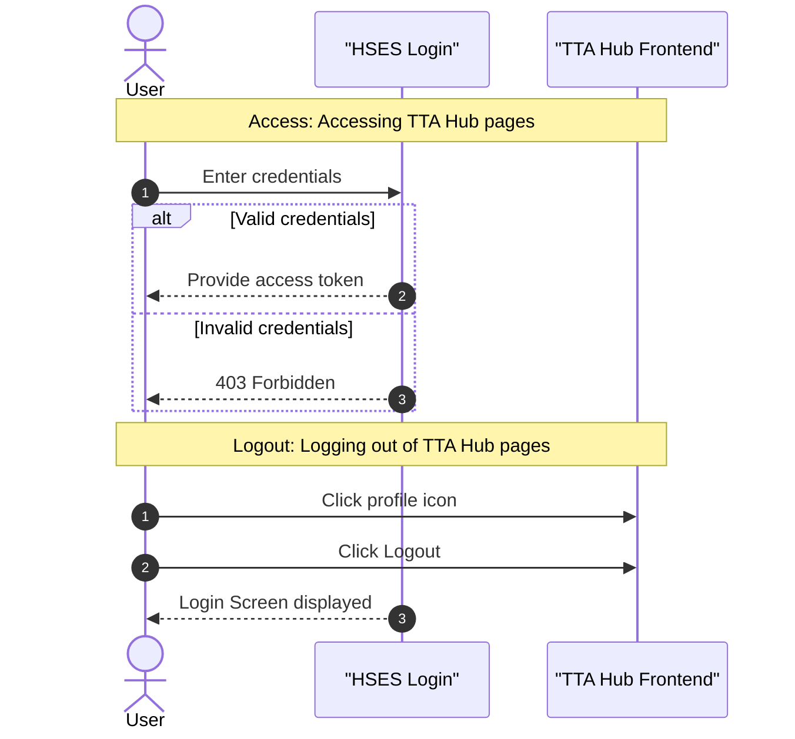

```mermaid
sequenceDiagram
  actor TTAProvider as User
  participant HSESLogin as "HSES Login"
  participant TTAHUBF as "TTA Hub Frontend"
 
    note over TTAProvider,TTAHUBF: Access: Accessing TTA Hub pages
    autonumber
    TTAProvider->>HSESLogin: Enter credentials
    alt Valid credentials
      HSESLogin-->>TTAProvider: Provide access token
    else Invalid credentials
      HSESLogin-->>TTAProvider: 403 Forbidden
    end

    note over TTAProvider,TTAHUBF: Logout: Logging out of TTA Hub pages
    autonumber 1
    TTAProvider->>TTAHUBF: Click profile icon
    TTAProvider->>TTAHUBF: Click Logout
    HSESLogin-->>TTAProvider: Login Screen displayed
 
```
