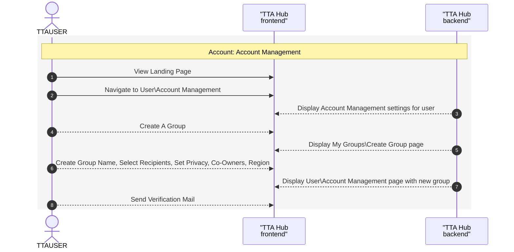

```mermaid
sequenceDiagram
  actor TU as TTAUSER
  participant FRONTEND as "TTA Hub<br>frontend"
  participant BACKEND as "TTA Hub<br>backend"

  rect rgb(245, 245, 245)
    note over TU,BACKEND: Account: Account Management
    autonumber 1
    TU->>FRONTEND: View Landing Page
    TU->>FRONTEND: Navigate to User\Account Management
    BACKEND-->>FRONTEND: Display Account Management settings for user
    TU-->>FRONTEND: Create A Group
    BACKEND-->>FRONTEND: Display My Groups\Create Group page
    TU-->>FRONTEND: Create Group Name, Select Recipients, Set Privacy, Co-Owners, Region
    BACKEND-->>FRONTEND: Display User\Account Management page with new group
    TU-->>FRONTEND: Send Verification Mail
  end
```
