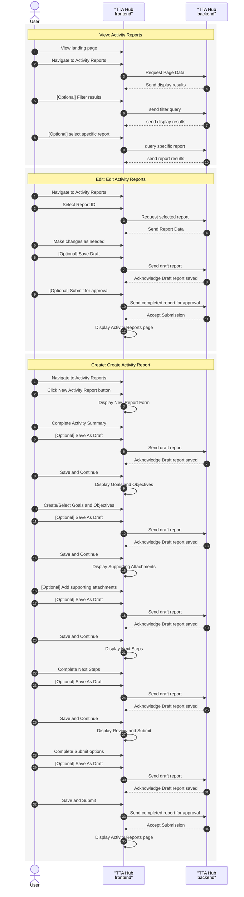

```mermaid
sequenceDiagram
  actor TTAProvider as User
  participant TTAHUBF as "TTA Hub<br>frontend"
  participant TTAHUBB as "TTA Hub<br>backend"

  rect rgb(245, 245, 245)
    note over TTAProvider,TTAHUBB: View: Activity Reports
    autonumber 1
    TTAProvider->>TTAHUBF: View landing page
    TTAProvider->>TTAHUBF: Navigate to Activity Reports
    TTAHUBF->>TTAHUBB: Request Page Data
    TTAHUBB-->>TTAHUBF: Send display results
    TTAProvider->>TTAHUBF: [Optional] Filter results
    TTAHUBF->>TTAHUBB: send filter query
    TTAHUBB-->>TTAHUBF: send display results
    TTAProvider->>TTAHUBF: [Optional] select specific report
    TTAHUBF->>TTAHUBB: query specific report
    TTAHUBB-->>TTAHUBF: send report results
  end

  rect rgb(245, 245, 245)
    note over TTAProvider,TTAHUBB: Edit: Edit Activity Reports
    autonumber 1
    TTAProvider->>TTAHUBF: Navigate to Activity Reports
    TTAProvider->>TTAHUBF: Select Report ID
    TTAHUBF->>TTAHUBB: Request selected report
    TTAHUBB-->>TTAHUBF: Send Report Data
    TTAProvider->>TTAHUBF: Make changes as needed
    TTAProvider->>TTAHUBF: [Optional] Save Draft
    TTAHUBF->>TTAHUBB: Send draft report
    TTAHUBB-->>TTAHUBF: Acknowledge Draft report saved
    TTAProvider->>TTAHUBF: [Optional] Submit for approval
    TTAHUBF->>TTAHUBB: Send completed report for approval
    TTAHUBB-->>TTAHUBF: Accept Submission
    TTAHUBF->>TTAHUBF: Display Activity Reports page
  end

  rect rgb(245, 245, 245)
    note over TTAProvider,TTAHUBB: Create: Create Activity Report
    autonumber 1
    TTAProvider->>TTAHUBF: Navigate to Activity Reports
    TTAProvider->>TTAHUBF: Click New Activity Report button
    TTAHUBF->>TTAHUBF: Display New Report Form
    TTAProvider->>TTAHUBF: Complete Activity Summary
    TTAProvider->>TTAHUBF: [Optional] Save As Draft
    TTAHUBF->>TTAHUBB: Send draft report
    TTAHUBB-->>TTAHUBF: Acknowledge Draft report saved
    TTAProvider->>TTAHUBF: Save and Continue
    TTAHUBF->>TTAHUBF: Display Goals and Objectives
    TTAProvider->>TTAHUBF: Create/Select Goals and Objectives
    TTAProvider->>TTAHUBF: [Optional] Save As Draft
    TTAHUBF->>TTAHUBB: Send draft report
    TTAHUBB-->>TTAHUBF: Acknowledge Draft report saved
    TTAProvider->>TTAHUBF: Save and Continue
    TTAHUBF->>TTAHUBF: Display Supporting Attachments
    TTAProvider->>TTAHUBF: [Optional] Add supporting attachments
    TTAProvider->>TTAHUBF: [Optional] Save As Draft
    TTAHUBF->>TTAHUBB: Send draft report
    TTAHUBB-->>TTAHUBF: Acknowledge Draft report saved
    TTAProvider->>TTAHUBF: Save and Continue
    TTAHUBF->>TTAHUBF: Display Next Steps
    TTAProvider->>TTAHUBF: Complete Next Steps
    TTAProvider->>TTAHUBF: [Optional] Save As Draft
    TTAHUBF->>TTAHUBB: Send draft report
    TTAHUBB-->>TTAHUBF: Acknowledge Draft report saved
    TTAProvider->>TTAHUBF: Save and Continue
    TTAHUBF->>TTAHUBF: Display Review and Submit
    TTAProvider->>TTAHUBF: Complete Submit options
    TTAProvider->>TTAHUBF: [Optional] Save As Draft
    TTAHUBF->>TTAHUBB: Send draft report
    TTAHUBB-->>TTAHUBF: Acknowledge Draft report saved
    TTAProvider->>TTAHUBF: Save and Submit
    TTAHUBF->>TTAHUBB: Send completed report for approval
    TTAHUBB-->>TTAHUBF: Accept Submission
    TTAHUBF->>TTAHUBF: Display Activity Reports page
  end
```
