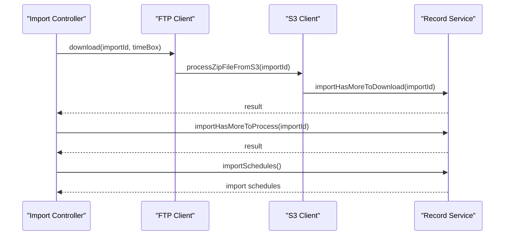

```mermaid
sequenceDiagram
  participant IMPORTCONTROLLER as "Import Controller"
  participant FTPCLIENT as "FTP Client"
  participant S3CLIENT as "S3 Client"
  participant RECORDSERVICE as "Record Service"

  IMPORTCONTROLLER->>FTPCLIENT: download(importId, timeBox)
  FTPCLIENT->>S3CLIENT: processZipFileFromS3(importId)
  S3CLIENT->>RECORDSERVICE: importHasMoreToDownload(importId)
  RECORDSERVICE-->>IMPORTCONTROLLER: result
  IMPORTCONTROLLER->>RECORDSERVICE: importHasMoreToProcess(importId)
  RECORDSERVICE-->>IMPORTCONTROLLER: result
  IMPORTCONTROLLER->>RECORDSERVICE: importSchedules()
  RECORDSERVICE-->>IMPORTCONTROLLER: import schedules
```
