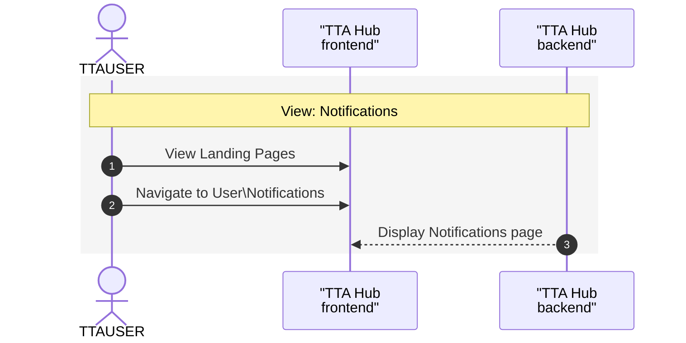

```mermaid
sequenceDiagram
  actor TU as TTAUSER
  participant FRONTEND as "TTA Hub<br>frontend"
  participant BACKEND as "TTA Hub<br>backend"

  rect rgb(245, 245, 245)
    note over TU,BACKEND: View: Notifications
    autonumber 1
    TU->>FRONTEND: View Landing Pages
    TU->>FRONTEND: Navigate to User\Notifications
    BACKEND-->>FRONTEND: Display Notifications page
  end
```
