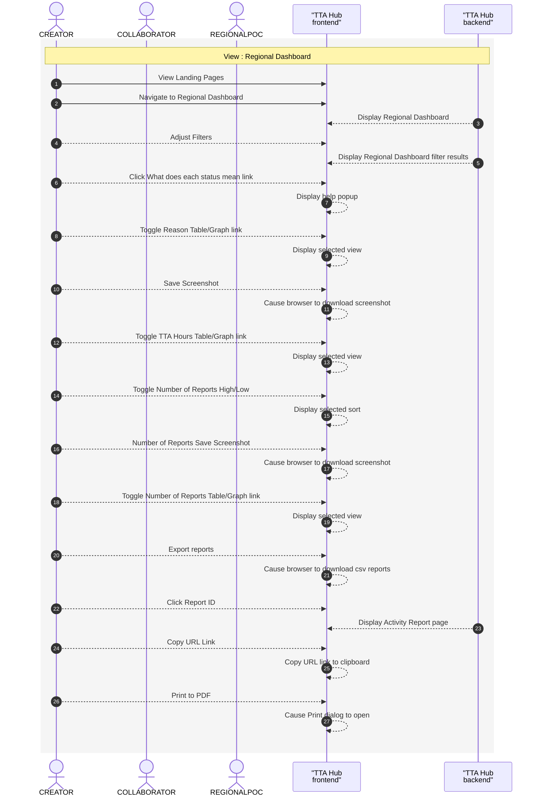

```mermaid
sequenceDiagram
  actor CR as CREATOR
  actor CL as COLLABORATOR
  actor RPOC as REGIONALPOC
  participant FRONTEND as "TTA Hub<br>frontend"
  participant BACKEND as "TTA Hub<br>backend"

  rect rgb(245, 245, 245)
    note over CR,BACKEND: View : Regional Dashboard
    autonumber 1
    CR->>FRONTEND: View Landing Pages
    CR->>FRONTEND: Navigate to Regional Dashboard
    BACKEND-->>FRONTEND: Display Regional Dashboard
    CR-->>FRONTEND: Adjust Filters
    BACKEND-->>FRONTEND: Display Regional Dashboard filter results
    CR-->>FRONTEND: Click What does each status mean link
    FRONTEND-->>FRONTEND: Display help popup
    CR-->>FRONTEND: Toggle Reason Table/Graph link
    FRONTEND-->>FRONTEND: Display selected view
    CR-->>FRONTEND: Save Screenshot
    FRONTEND-->>FRONTEND: Cause browser to download screenshot
    CR-->>FRONTEND: Toggle TTA Hours Table/Graph link
    FRONTEND-->>FRONTEND: Display selected view
    CR-->>FRONTEND: Toggle Number of Reports High/Low
    FRONTEND-->>FRONTEND: Display selected sort
    CR-->>FRONTEND: Number of Reports Save Screenshot
    FRONTEND-->>FRONTEND: Cause browser to download screenshot
    CR-->>FRONTEND: Toggle Number of Reports Table/Graph link
    FRONTEND-->>FRONTEND: Display selected view
    CR-->>FRONTEND: Export reports
    FRONTEND-->>FRONTEND: Cause browser to download csv reports
    CR-->>FRONTEND: Click Report ID
    BACKEND-->>FRONTEND: Display Activity Report page
    CR-->>FRONTEND: Copy URL Link
    FRONTEND-->>FRONTEND: Copy URL link to clipboard
    CR-->>FRONTEND: Print to PDF
    FRONTEND-->>FRONTEND: Cause Print dialog to open
  end
```
