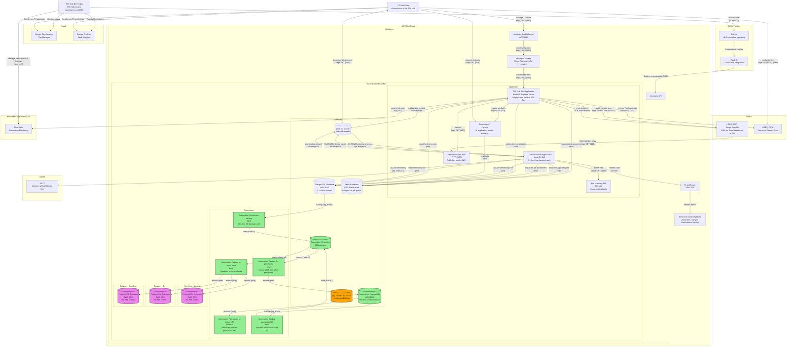

System Boundary Diagram
=======================

```mermaid
flowchart TB
    %% TTA Hub Boundary View - Converted from PlantUML C4

    %% External Actors
    personnel["TTA Hub User<br>An end-user of the TTA Hub"]
    developer["TTA Hub Developer<br>TTA Hub vendor developers and GTM"]

    %% AWS GovCloud Boundary
    subgraph aws["AWS GovCloud"]
        AWS_SES_SMTP_Server["Email Server<br>AWS SES"]
        AWS_SNS["Bounces and Complaints<br>AWS SNS - Simple Notifications Service"]
        
        %% cloud.gov Boundary
        subgraph cloudgov["cloud.gov"]
            aws_alb["cloud.gov load-balancer<br>AWS ALB"]
            cloudgov_api["cloud.gov API"]
            cloudgov_router["cloud.gov routers<br>Cloud Foundry traffic service"]
            
            %% Accreditation Boundary
            subgraph atob["Accreditation Boundary"]
                
                %% Application Boundary
                subgraph app["Application"]
                    www_app["TTA Hub Web Application<br>NodeJS, Express, React<br>Displays and collects TTA data"]
                    worker_app["TTA Hub Worker Application<br>NodeJS, Bull<br>Perform background work"]
                    similarity_api["Similarity API<br>Python<br>AI application for text similarity"]
                    clamav["File scanning API<br>ClamAV<br>Scans user uploads"]
                    www_jwks[".well-known/jwks.json<br>HTTP JSON<br>Publishes public JWK"]
                end
                
                %% Automation Boundary
                subgraph auto["Automation"]
                    auto_prod_backup["Automation Production backup<br>bash<br>Streams DB backup to s3"]:::green
                    auto_prod_restore["Automation Restore for processing<br>bash<br>Streams DB from s3 to processing"]:::green
                    auto_prod_proc["Automation Processing to remove PII<br>NodeJS<br>Removes PII from production data"]:::green
                    auto_proc_backup["Automation Backup processed DB<br>bash<br>Streams processed DB to s3"]:::green
                    auto_proc_restore["Automation Restore to lower envs<br>bash<br>Restores processed data"]:::green
                end
                
                %% Services Boundary
                subgraph cloudgov_services["Services"]
                    www_db[("PostgreSQL Database<br>AWS RDS<br>TTA Hub content")]
                    www_s3[("AWS S3 bucket<br>Static file assets")]
                    www_redis[("Redis Database<br>AWS Elasticache<br>Background job queue")]
                    auto_db[("Automation PostgreSQL<br>AWS RDS<br>Process production data")]:::green
                    auto_s3[("Automation S3 bucket<br>DB backups")]:::green
                    logs_s3[("Log transfer S3 bucket<br>Production DB logs")]:::orange
                end
                
                %% Staging Services
                subgraph cloudgov_services_staging["Services - Staging"]
                    staging_db[("PostgreSQL Database<br>AWS RDS<br>PII-free testing")]:::violet
                end
                
                %% Dev Services
                subgraph cloudgov_services_dev["Services - Dev"]
                    dev_db[("PostgreSQL Database<br>AWS RDS<br>PII-free testing")]:::violet
                end
                
                %% Sandbox Services
                subgraph cloudgov_services_sandbox["Services - Sandbox"]
                    sandbox_db[("PostgreSQL Database<br>AWS RDS<br>PII-free testing")]:::violet
                end
            end
        end
    end

    %% HSES Boundary
    subgraph hses["HSES"]
        HSES_AUTH["HSES_AUTH<br>Single Sign On<br>MFA via Time-Based App or PIV"]
        HSES_DATA["HSES_DATA<br>Source of Grantee Data"]
    end

    %% ITAMS Boundary
    subgraph itams["ITAMS"]
        SFTP["SFTP<br>Monitoring/CLASS data files"]
    end

    %% SaaS Boundary
    subgraph gsa_saas["SaaS"]
        google_tag_manager["Google Tag Manager<br>Tag Manager"]
        google_analytics["Google Analytics<br>Web Analytics"]
    end

    %% FedRAMP SaaS Boundary
    subgraph gsa_fed_saas["FedRAMP-approved SaaS"]
        newrelic["New Relic<br>Continuous Monitoring"]
    end

    %% CI/CD Pipeline
    subgraph development_saas["CI/CD Pipeline"]
        github["GitHub<br>HHS-controlled repository"]
        circleci["CircleCI<br>Continuous Integration"]
    end

    %% Relationships - Backup/Restore Flow
    www_db -->|"backup (pg_dump)"| auto_prod_backup
    auto_prod_backup -->|"store (aws s3)"| auto_s3
    auto_s3 -->|"retrieve (aws s3)"| auto_prod_restore
    auto_prod_restore -->|"restore (psql)"| auto_db
    auto_db <-->|"process (psql)"| auto_prod_proc
    auto_db -->|"backup (pg_dump)"| auto_proc_backup
    auto_proc_backup -->|"store (aws s3)"| auto_s3
    auto_s3 -->|"retrieve (aws s3)"| auto_proc_restore
    auto_proc_restore -->|"restore (psql)"| staging_db
    auto_proc_restore -->|"restore (psql)"| dev_db
    auto_proc_restore -->|"restore (psql)"| sandbox_db

    %% Developer Relationships
    developer -->|"Manage performance & logging<br>https (443)"| newrelic
    www_app -->|"reports telemetry<br>tcp (443)"| newrelic
    developer -->|"Configure tags"| google_tag_manager
    developer -->|"View traffic statistics"| google_analytics
    
    %% Personnel Relationships
    personnel -->|"Sends non-PII traffic data"| google_analytics
    personnel -->|"Sends non-PII tags data"| google_tag_manager
    personnel -->|"manage TTA data<br>https, WSS (443)"| aws_alb
    www_s3 -->|"download attachments<br>https GET (443)"| personnel
    
    %% Routing
    aws_alb -->|"proxies requests<br>https, WSS (443)"| cloudgov_router
    cloudgov_router -->|"proxies requests<br>https, WSS (443)"| www_app
    
    %% Worker Relationships
    worker_app -->|"scans files<br>https POST (9443)"| clamav
    worker_app -->|"notifies users<br>port 587"| AWS_SES_SMTP_Server
    AWS_SES_SMTP_Server -->|"notifies admin"| AWS_SNS
    
    %% HSES Integration
    www_app -->|"retrieve Recipient data<br>https GET (443)"| HSES_DATA
    www_app -->|"authenticates user<br>OIDC (Auth Code + PKCE)"| HSES_AUTH
    www_app -->|"serves<br>https GET (443)"| www_jwks
    HSES_AUTH -->|"fetches public keys<br>https GET (443)"| www_jwks
    personnel -->|"verify identity<br>https GET/POST (443)"| HSES_DATA
    www_app -->|"ends session<br>OIDC end-session"| HSES_AUTH
    
    %% SFTP/CLASS/Monitoring
    worker_app <-->|"CLASS/Monitoring<br>sftp, SSH (22)"| SFTP
    worker_app -->|"CLASS/Monitoring cache<br>vpc endpoint"| www_s3
    www_s3 -->|"CLASS/Monitoring process<br>vpc endpoint"| worker_app
    worker_app -->|"CLASS/Monitoring save<br>psql"| www_db
    
    %% Similarity API
    www_app -->|"request similarity<br>https GET (443)"| similarity_api
    personnel -->|"request similarity<br>https GET (443)"| similarity_api
    similarity_api -->|"read data<br>psql"| www_db
    
    %% Database & Storage Relationships
    www_app <-->|"reads/writes records<br>psql"| www_db
    worker_app <-->|"reads/writes records<br>psql"| www_db
    www_app <-->|"reads/writes content<br>vpc endpoint"| www_s3
    worker_app <-->|"reads/writes content<br>vpc endpoint"| www_s3
    
    %% Redis Relationships
    www_app -->|"enqueues job parameters<br>redis"| www_redis
    worker_app <-->|"dequeues/updates jobs<br>redis"| www_redis
    worker_app -->|"enqueues job parameters<br>redis"| www_redis
    www_app <-->|"websocket coordination<br>redis"| www_redis
    
    %% CI/CD Relationships
    developer -->|"Publish code<br>git ssh (22)"| github
    github -->|"Commit hook notifies"| circleci
    circleci -->|"Deploy on successful CI/CD"| cloudgov_api

    %% Styling
    classDef green fill:#90EE90,stroke:#333,stroke-width:2px
    classDef violet fill:#EE82EE,stroke:#333,stroke-width:2px
    classDef orange fill:#FFA500,stroke:#333,stroke-width:2px

```