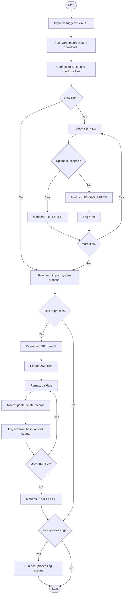

```mermaid
flowchart TD
  Start([Start])
  TriggerCLI[Import is triggered via CLI]
  RunDownload[Run `yarn import:system download <importId>`]
  ConnectSFTP[Connect to SFTP and check for files]
  NewFiles{New files?}
  StreamFile[Stream file to S3]
  UploadOk{Upload succeeds?}
  MarkCollected[Mark as COLLECTED]
  MarkUploadFailed[Mark as UPLOAD_FAILED]
  LogError[Log error]
  MoreFiles{More files?}
  RunProcess[Run `yarn import:system process <importId>`]
  FilesToProcess{Files to process?}
  DownloadZip[Download ZIP from S3]
  ExtractXML[Extract XML files]
  RemapValidate[Remap, validate]
  InsertRecords[Insert/update/delete records]
  LogSchema[Log schema, hash, record counts]
  MoreXML{More XML files?}
  MarkProcessed[Mark as PROCESSED]
  PostProcessing{Post-processing?}
  RunPost[Run post-processing actions]
  Stop([Stop])

  Start --> TriggerCLI --> RunDownload --> ConnectSFTP --> NewFiles
  NewFiles -- Yes --> StreamFile --> UploadOk
  UploadOk -- Yes --> MarkCollected --> MoreFiles
  UploadOk -- No --> MarkUploadFailed --> LogError --> MoreFiles
  MoreFiles -- Yes --> StreamFile
  NewFiles -- No --> RunProcess
  MoreFiles -- No --> RunProcess

  RunProcess --> FilesToProcess
  FilesToProcess -- Yes --> DownloadZip --> ExtractXML --> RemapValidate --> InsertRecords --> LogSchema --> MoreXML
  MoreXML -- Yes --> RemapValidate
  MoreXML -- No --> MarkProcessed --> PostProcessing
  FilesToProcess -- No --> PostProcessing

  PostProcessing -- Yes --> RunPost --> Stop
  PostProcessing -- No --> Stop
```
