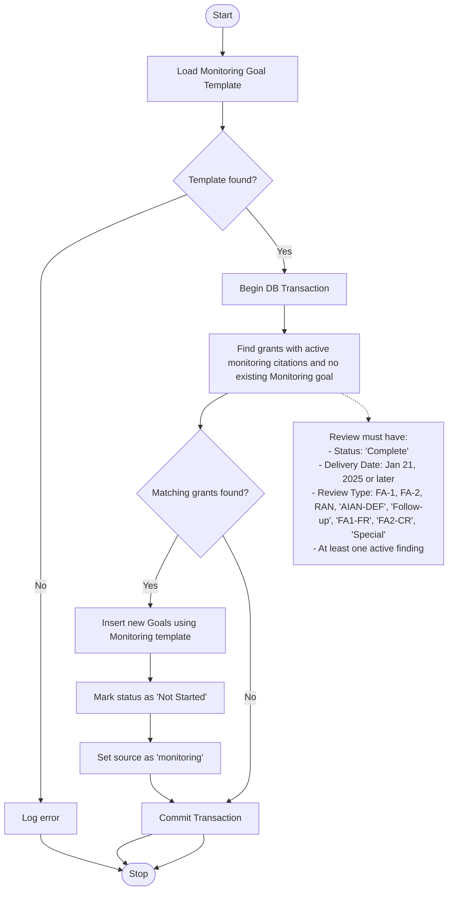

```mermaid
flowchart TD
  Start([Start])
  Load[Load Monitoring Goal Template]
  TemplateFound{Template found?}
  LogError[Log error]
  Stop([Stop])
  BeginTxn[Begin DB Transaction]
  FindGrants[Find grants with active monitoring citations and no existing Monitoring goal]
  ReviewNote["Review must have:<br>- Status: 'Complete'<br>- Delivery Date: Jan 21, 2025 or later<br>- Review Type: FA-1, FA-2, RAN, 'AIAN-DEF', 'Follow-up', 'FA1-FR', 'FA2-CR', 'Special'<br>- At least one active finding"]
  MatchingGrants{Matching grants found?}
  InsertGoals[Insert new Goals using Monitoring template]
  MarkStatus[Mark status as 'Not Started']
  SetSource[Set source as 'monitoring']
  Commit[Commit Transaction]

  Start --> Load --> TemplateFound
  TemplateFound -- No --> LogError --> Stop
  TemplateFound -- Yes --> BeginTxn --> FindGrants --> MatchingGrants
  FindGrants -.-> ReviewNote
  MatchingGrants -- Yes --> InsertGoals --> MarkStatus --> SetSource --> Commit --> Stop
  MatchingGrants -- No --> Commit --> Stop
```
