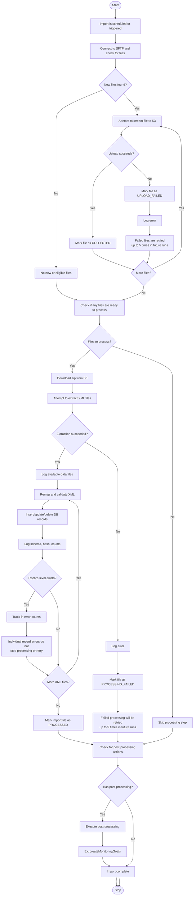

```mermaid
flowchart TD
  Start([Start])
  Trigger[Import is scheduled or triggered]
  ConnectSFTP[Connect to SFTP and check for files]
  NewFiles{New files found?}
  StreamFile[Attempt to stream file to S3]
  UploadOk{Upload succeeds?}
  MarkCollected[Mark file as COLLECTED]
  MarkUploadFailed[Mark file as UPLOAD_FAILED]
  LogUploadError[Log error]
  UploadRetryNote["Failed files are retried<br>up to 5 times in future runs"]
  MoreFiles{More files?}
  NoFiles[No new or eligible files]
  ReadyToProcess[Check if any files are ready to process]
  FilesToProcess{Files to process?}
  DownloadZip[Download zip from S3]
  Extract[Attempt to extract XML files]
  ExtractOk{Extraction succeeded?}
  LogDataFiles[Log available data files]
  RemapValidate[Remap and validate XML]
  InsertRecords[Insert/update/delete DB records]
  LogSchema[Log schema, hash, counts]
  RecordErrors{Record-level errors?}
  TrackErrors[Track in error counts]
  RecordErrorNote["Individual record errors do not<br>stop processing or retry"]
  MoreXML{More XML files?}
  MarkProcessed[Mark importFile as PROCESSED]
  LogProcessingError[Log error]
  MarkProcessingFailed[Mark file as PROCESSING_FAILED]
  ProcessingRetryNote["Failed processing will be retried<br>up to 5 times in future runs"]
  SkipProcessing[Skip processing step]
  PostProcessingCheck[Check for post-processing actions]
  HasPostProcessing{Has post-processing?}
  ExecutePost[Execute post-processing]
  CreateMonitoring[Ex. createMonitoringGoals]
  Complete[Import complete]
  Stop([Stop])

  Start --> Trigger --> ConnectSFTP --> NewFiles
  NewFiles -- Yes --> StreamFile --> UploadOk
  UploadOk -- Yes --> MarkCollected --> MoreFiles
  UploadOk -- No --> MarkUploadFailed --> LogUploadError --> UploadRetryNote --> MoreFiles
  NewFiles -- No --> NoFiles --> ReadyToProcess
  MoreFiles -- Yes --> StreamFile
  MoreFiles -- No --> ReadyToProcess

  ReadyToProcess --> FilesToProcess
  FilesToProcess -- Yes --> DownloadZip --> Extract --> ExtractOk
  ExtractOk -- Yes --> LogDataFiles --> RemapValidate --> InsertRecords --> LogSchema --> RecordErrors
  RecordErrors -- Yes --> TrackErrors --> RecordErrorNote --> MoreXML
  RecordErrors -- No --> MoreXML
  MoreXML -- Yes --> RemapValidate
  MoreXML -- No --> MarkProcessed --> PostProcessingCheck

  ExtractOk -- No --> LogProcessingError --> MarkProcessingFailed --> ProcessingRetryNote --> PostProcessingCheck
  FilesToProcess -- No --> SkipProcessing --> PostProcessingCheck

  PostProcessingCheck --> HasPostProcessing
  HasPostProcessing -- Yes --> ExecutePost --> CreateMonitoring --> Complete --> Stop
  HasPostProcessing -- No --> Complete --> Stop
```
