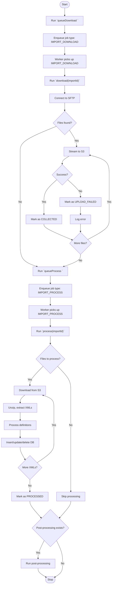

```mermaid
flowchart TD
  Start([Start])
  QueueDownload["Run `queueDownload <importId>`"]
  EnqueueDownload["Enqueue job type: IMPORT_DOWNLOAD"]
  WorkerDownload[Worker picks up IMPORT_DOWNLOAD]
  RunDownload["Run `download(importId)`"]
  ConnectSFTP[Connect to SFTP]
  FilesFound{Files found?}
  StreamS3[Stream to S3]
  UploadOk{Success?}
  MarkCollected[Mark as COLLECTED]
  MarkUploadFailed[Mark as UPLOAD_FAILED]
  LogError[Log error]
  MoreFiles{More files?}
  QueueProcess["Run `queueProcess <importId>`"]
  EnqueueProcess["Enqueue job type: IMPORT_PROCESS"]
  WorkerProcess[Worker picks up IMPORT_PROCESS]
  RunProcess["Run `process(importId)`"]
  FilesToProcess{Files to process?}
  DownloadS3[Download from S3]
  Unzip[Unzip, extract XMLs]
  ProcessDefinitions[Process definitions]
  UpdateDB[Insert/update/delete DB]
  MoreXMLs{More XMLs?}
  MarkProcessed[Mark as PROCESSED]
  SkipProcessing[Skip processing]
  PostProcessing{Post-processing exists?}
  RunPost[Run post-processing]
  Stop([Stop])

  Start --> QueueDownload --> EnqueueDownload --> WorkerDownload --> RunDownload --> ConnectSFTP --> FilesFound
  FilesFound -- Yes --> StreamS3 --> UploadOk
  UploadOk -- Yes --> MarkCollected --> MoreFiles
  UploadOk -- No --> MarkUploadFailed --> LogError --> MoreFiles
  MoreFiles -- Yes --> StreamS3
  FilesFound -- No --> QueueProcess
  MoreFiles -- No --> QueueProcess

  QueueProcess --> EnqueueProcess --> WorkerProcess --> RunProcess --> FilesToProcess
  FilesToProcess -- Yes --> DownloadS3 --> Unzip --> ProcessDefinitions --> UpdateDB --> MoreXMLs
  MoreXMLs -- Yes --> DownloadS3
  MoreXMLs -- No --> MarkProcessed --> PostProcessing
  FilesToProcess -- No --> SkipProcessing --> PostProcessing

  PostProcessing -- Yes --> RunPost --> Stop
  PostProcessing -- No --> Stop
```
