# Monitoring Data Entity Relationship Diagram

```mermaid
erDiagram

%% Link Tables (ID mappings for external data)
MONITORING_FINDING_LINKS {
  int id PK "auto-generated"
  timestamp createdAt "NOT NULL"
  text findingId "NOT NULL"
  timestamp updatedAt "NOT NULL"
  timestamp deletedAt "nullable"
}

MONITORING_FINDING_HISTORY_STATUS_LINKS {
  int id PK "auto-generated"
  timestamp createdAt "NOT NULL"
  int statusId "NOT NULL"
  timestamp updatedAt "NOT NULL"
  timestamp deletedAt "nullable"
}

MONITORING_FINDING_STATUS_LINKS {
  int id PK "auto-generated"
  timestamp createdAt "NOT NULL"
  int statusId "NOT NULL"
  timestamp updatedAt "NOT NULL"
  timestamp deletedAt "nullable"
}

MONITORING_GRANTEE_LINKS {
  int id PK "auto-generated"
  timestamp createdAt "NOT NULL"
  text granteeId "NOT NULL"
  timestamp updatedAt "NOT NULL"
  timestamp deletedAt "nullable"
}

MONITORING_REVIEW_LINKS {
  int id PK "auto-generated"
  timestamp createdAt "NOT NULL"
  text reviewId "NOT NULL"
  timestamp updatedAt "NOT NULL"
  timestamp deletedAt "nullable"
}

MONITORING_REVIEW_STATUS_LINKS {
  int id PK "auto-generated"
  timestamp createdAt "NOT NULL"
  int statusId "NOT NULL"
  timestamp updatedAt "NOT NULL"
  timestamp deletedAt "nullable"
}

MONITORING_STANDARD_LINKS {
  int id PK "auto-generated"
  timestamp createdAt "NOT NULL"
  int standardId "NOT NULL"
  timestamp updatedAt "NOT NULL"
  timestamp deletedAt "nullable"
}

%% Status Tables
MONITORING_FINDING_HISTORY_STATUSES {
  int id PK "auto-generated"
  int statusId FK "NOT NULL, references MonitoringFindingHistoryStatusLinks"
  timestamp createdAt "NOT NULL"
  text name "NOT NULL"
  timestamp sourceCreatedAt "NOT NULL"
  timestamp sourceUpdatedAt "NOT NULL"
  timestamp updatedAt "NOT NULL"
  timestamp deletedAt "nullable"
  timestamp sourceDeletedAt "nullable"
}

MONITORING_FINDING_STATUSES {
  int id PK "auto-generated"
  int statusId FK "NOT NULL, references MonitoringFindingStatusLinks"
  timestamp createdAt "NOT NULL"
  text name "NOT NULL"
  timestamp sourceCreatedAt "NOT NULL"
  timestamp sourceUpdatedAt "NOT NULL"
  timestamp updatedAt "NOT NULL"
  timestamp deletedAt "nullable"
  timestamp sourceDeletedAt "nullable"
}

MONITORING_REVIEW_STATUSES {
  int id PK "auto-generated"
  int statusId FK "NOT NULL, references MonitoringReviewStatusLinks"
  timestamp createdAt "NOT NULL"
  text name "NOT NULL"
  timestamp sourceCreatedAt "NOT NULL"
  timestamp sourceUpdatedAt "NOT NULL"
  timestamp updatedAt "NOT NULL"
  timestamp deletedAt "nullable"
  timestamp sourceDeletedAt "nullable"
}

%% Review Tables
MONITORING_REVIEWS {
  int id PK "auto-generated"
  text reviewId FK "NOT NULL, references MonitoringReviewLinks"
  int statusId FK "NOT NULL, references MonitoringReviewStatusLinks"
  text contentId "NOT NULL"
  timestamp createdAt "NOT NULL"
  timestamp sourceCreatedAt "NOT NULL"
  timestamp sourceUpdatedAt "NOT NULL"
  timestamp updatedAt "NOT NULL"
  timestamp deletedAt "nullable"
  date endDate "nullable"
  text hash "nullable"
  text name "nullable"
  text outcome "nullable"
  text reportAttachmentId "nullable"
  timestamp reportDeliveryDate "nullable"
  text reviewType "nullable"
  timestamp sourceDeletedAt "nullable"
  date startDate "nullable"
}

MONITORING_CLASS_SUMMARIES {
  int id PK "auto-generated"
  text grantNumber FK "NOT NULL, references GrantNumberLinks"
  text reviewId FK "NOT NULL, references MonitoringReviewLinks"
  timestamp createdAt "NOT NULL"
  timestamp sourceCreatedAt "NOT NULL"
  timestamp sourceUpdatedAt "NOT NULL"
  timestamp updatedAt "NOT NULL"
  decimal classroomOrganization "nullable, precision(5,4)"
  timestamp deletedAt "nullable"
  decimal emotionalSupport "nullable, precision(5,4)"
  text hash "nullable"
  decimal instructionalSupport "nullable, precision(5,4)"
  timestamp reportDeliveryDate "nullable"
  timestamp sourceDeletedAt "nullable"
}

MONITORING_REVIEW_GRANTEES {
  int id PK "auto-generated"
  text granteeId FK "NOT NULL, references MonitoringGranteeLinks"
  text grantNumber FK "NOT NULL, references GrantNumberLinks"
  text reviewId FK "NOT NULL, references MonitoringReviewLinks"
  timestamp createdAt "NOT NULL"
  timestamp createTime "NOT NULL"
  timestamp sourceCreatedAt "NOT NULL"
  timestamp sourceUpdatedAt "NOT NULL"
  text updateBy "NOT NULL"
  timestamp updatedAt "NOT NULL"
  timestamp updateTime "NOT NULL"
  timestamp deletedAt "nullable"
  timestamp sourceDeletedAt "nullable"
}

%% Finding Tables
MONITORING_FINDINGS {
  int id PK "auto-generated"
  text findingId FK "NOT NULL, references MonitoringFindingLinks"
  int statusId FK "NOT NULL, references MonitoringFindingStatusLinks"
  timestamp createdAt "NOT NULL"
  text findingType "NOT NULL"
  text hash "NOT NULL"
  timestamp sourceCreatedAt "NOT NULL"
  timestamp sourceUpdatedAt "NOT NULL"
  timestamp updatedAt "NOT NULL"
  timestamp closedDate "nullable"
  timestamp correctionDeadLine "nullable"
  timestamp deletedAt "nullable"
  timestamp reportedDate "nullable"
  text source "nullable"
  timestamp sourceDeletedAt "nullable"
}

MONITORING_FINDING_GRANTS {
  int id PK "auto-generated"
  text findingId FK "NOT NULL, references MonitoringFindingLinks"
  text granteeId FK "NOT NULL, references MonitoringGranteeLinks"
  int statusId FK "NOT NULL, references MonitoringFindingStatusLinks"
  timestamp createdAt "NOT NULL"
  text findingType "NOT NULL"
  text hash "NOT NULL"
  timestamp sourceCreatedAt "NOT NULL"
  timestamp sourceUpdatedAt "NOT NULL"
  timestamp updatedAt "NOT NULL"
  timestamp closedDate "nullable"
  timestamp correctionDeadLine "nullable"
  timestamp deletedAt "nullable"
  timestamp reportedDate "nullable"
  text source "nullable"
  timestamp sourceDeletedAt "nullable"
}

MONITORING_FINDING_HISTORIES {
  int id PK "auto-generated"
  text findingId FK "nullable, references MonitoringFindingLinks"
  int statusId FK "nullable, references MonitoringFindingHistoryStatusLinks"
  text reviewId FK "NOT NULL, references MonitoringReviewLinks"
  timestamp createdAt "NOT NULL"
  text findingHistoryId "NOT NULL"
  timestamp sourceCreatedAt "NOT NULL"
  timestamp sourceUpdatedAt "NOT NULL"
  timestamp updatedAt "NOT NULL"
  timestamp deletedAt "nullable"
  text determination "nullable"
  text hash "nullable"
  text narrative "nullable"
  int ordinal "nullable"
  timestamp sourceDeletedAt "nullable"
}

MONITORING_FINDING_STANDARDS {
  int id PK "auto-generated"
  text findingId FK "NOT NULL, references MonitoringFindingLinks"
  int standardId FK "NOT NULL, references MonitoringStandardLinks"
  timestamp createdAt "NOT NULL"
  timestamp sourceCreatedAt "NOT NULL"
  timestamp sourceUpdatedAt "NOT NULL"
  timestamp updatedAt "NOT NULL"
  timestamp deletedAt "nullable"
  timestamp sourceDeletedAt "nullable"
}

%% Standards Tables
MONITORING_STANDARDS {
  int id PK "auto-generated"
  int standardId FK "NOT NULL, references MonitoringStandardLinks"
  int citable "NOT NULL"
  text contentId "NOT NULL"
  timestamp createdAt "NOT NULL"
  text hash "NOT NULL"
  timestamp sourceCreatedAt "NOT NULL"
  timestamp sourceUpdatedAt "NOT NULL"
  timestamp updatedAt "NOT NULL"
  text citation "nullable"
  timestamp deletedAt "nullable"
  text guidance "nullable"
  timestamp sourceDeletedAt "nullable"
  text text "nullable"
}

%% Link Table Relationships
MONITORING_FINDING_HISTORY_STATUS_LINKS ||--o{ MONITORING_FINDING_HISTORIES : "defines status for"
MONITORING_FINDING_HISTORY_STATUS_LINKS ||--o{ MONITORING_FINDING_HISTORY_STATUSES : "maps to"

MONITORING_FINDING_STATUS_LINKS ||--o{ MONITORING_FINDING_GRANTS : "defines status for"
MONITORING_FINDING_STATUS_LINKS ||--o{ MONITORING_FINDING_STATUSES : "maps to"
MONITORING_FINDING_STATUS_LINKS ||--o{ MONITORING_FINDINGS : "defines status for"

MONITORING_REVIEW_STATUS_LINKS ||--o{ MONITORING_REVIEW_STATUSES : "maps to"
MONITORING_REVIEW_STATUS_LINKS ||--o{ MONITORING_REVIEWS : "defines status for"

MONITORING_STANDARD_LINKS ||--o{ MONITORING_FINDING_STANDARDS : "used in"
MONITORING_STANDARD_LINKS ||--o{ MONITORING_STANDARDS : "maps to"

%% Finding Relationships
MONITORING_FINDING_LINKS ||--o{ MONITORING_FINDING_GRANTS : "grant-specific"
MONITORING_FINDING_LINKS ||--o{ MONITORING_FINDING_HISTORIES : "has history"
MONITORING_FINDING_LINKS ||--o{ MONITORING_FINDING_STANDARDS : "violates standards"
MONITORING_FINDING_LINKS ||--o{ MONITORING_FINDINGS : "details"

%% Grantee Relationships
MONITORING_GRANTEE_LINKS ||--o{ MONITORING_FINDING_GRANTS : "has findings"
MONITORING_GRANTEE_LINKS ||--o{ MONITORING_REVIEW_GRANTEES : "participates in"

%% Review Relationships
MONITORING_REVIEW_LINKS ||--o{ MONITORING_CLASS_SUMMARIES : "has CLASS scores"
MONITORING_REVIEW_LINKS ||--o{ MONITORING_FINDING_HISTORIES : "produces findings"
MONITORING_REVIEW_LINKS ||--o{ MONITORING_REVIEW_GRANTEES : "includes grantees"
MONITORING_REVIEW_LINKS ||--o{ MONITORING_REVIEWS : "details"
```

## Crow's Foot Notation Guide

The relationship lines use industry-standard crow's foot notation:

- `||--o{` = **One-to-many** (zero or more on the many side)
  - Example: One review link has zero or more review records

**Symbol meanings:**
- `||` = Exactly one (required)
- `o|` = Zero or one (optional)
- `}o` = Zero or more (optional, many)
- `}|` = One or more (required, many)

## Field Notation

- **PK** = Primary key
- **FK** = Foreign key
- **"NOT NULL"** = Required field
- **"nullable"** = Optional field
- **"auto-generated"** = Database-generated value
- **"precision(m,n)"** = Decimal precision

## About This Diagram

This diagram represents the monitoring data imported from IT-AMS, including compliance reviews, findings, and CLASS assessment scores.

### Data Architecture Pattern

The monitoring schema uses a **link table pattern** to handle external IDs:

**Link Tables** (e.g., `MONITORING_REVIEW_LINKS`) serve as:
- ID translation layer between external system IDs (text) and internal IDs (int)
- Soft-delete tracking for external records
- Audit trail for data synchronization

**Data Tables** (e.g., `MONITORING_REVIEWS`) contain:
- Actual monitoring data and attributes
- Foreign keys to link tables (not direct external IDs)
- Source system timestamps (sourceCreatedAt, sourceUpdatedAt)

### Key Entities

**Reviews:**
- **MONITORING_REVIEWS** - Compliance review records (FA-1, FA-2, RAN, etc.)
- **MONITORING_CLASS_SUMMARIES** - CLASS assessment scores for reviews
- **MONITORING_REVIEW_GRANTEES** - Grantees included in each review

**Findings:**
- **MONITORING_FINDINGS** - Compliance findings and deficiencies
- **MONITORING_FINDING_GRANTS** - Grant-specific finding associations
- **MONITORING_FINDING_HISTORIES** - Finding status change history
- **MONITORING_FINDING_STANDARDS** - Standards violated by findings

**Standards:**
- **MONITORING_STANDARDS** - Head Start Program Performance Standards catalog

**Statuses:**
- **MONITORING_FINDING_STATUSES** - Finding states (Active, Closed, etc.)
- **MONITORING_FINDING_HISTORY_STATUSES** - Historical finding states
- **MONITORING_REVIEW_STATUSES** - Review states (Complete, In Progress, etc.)

### Data Flow

1. **Import** - Data synced from IT-AMS SFTP
2. **Link Tables** - External IDs mapped to internal IDs
3. **Data Tables** - Monitoring records created/updated
4. **Goal Creation** - Monitoring goals auto-created for active findings (see flow-diagrams/monitoring-goal-create-flow.md)

## Editing This Diagram

This diagram uses Mermaid ER Diagram syntax with crow's foot notation and renders directly in GitHub.

To edit:
1. Modify the Mermaid source in this file
2. Preview changes by viewing this file in GitHub or using a [Mermaid preview tool](https://mermaid.live/)
3. GitHub will automatically render the updated diagram

See the [Mermaid ER Diagram documentation](https://mermaid.js.org/syntax/entityRelationshipDiagram.html) for syntax help.
