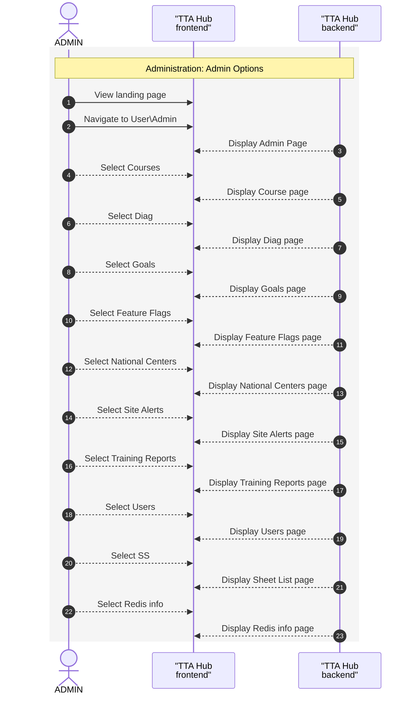

```mermaid
sequenceDiagram
  actor AD as ADMIN
  participant FRONTEND as "TTA Hub<br>frontend"
  participant BACKEND as "TTA Hub<br>backend"

  rect rgb(245, 245, 245)
    note over AD,BACKEND: Administration: Admin Options
    autonumber 1
    AD->>FRONTEND: View landing page
    AD->>FRONTEND: Navigate to User\Admin
    BACKEND-->>FRONTEND: Display Admin Page
    AD-->>FRONTEND: Select Courses
    BACKEND-->>FRONTEND: Display Course page
    AD-->>FRONTEND: Select Diag
    BACKEND-->>FRONTEND: Display Diag page
    AD-->>FRONTEND: Select Goals
    BACKEND-->>FRONTEND: Display Goals page
    AD-->>FRONTEND: Select Feature Flags
    BACKEND-->>FRONTEND: Display Feature Flags page
    AD-->>FRONTEND: Select National Centers
    BACKEND-->>FRONTEND: Display National Centers page
    AD-->>FRONTEND: Select Site Alerts
    BACKEND-->>FRONTEND: Display Site Alerts page
    AD-->>FRONTEND: Select Training Reports
    BACKEND-->>FRONTEND: Display Training Reports page
    AD-->>FRONTEND: Select Users
    BACKEND-->>FRONTEND: Display Users page
    AD-->>FRONTEND: Select SS
    BACKEND-->>FRONTEND: Display Sheet List page
    AD-->>FRONTEND: Select Redis info
    BACKEND-->>FRONTEND: Display Redis info page
  end
```
