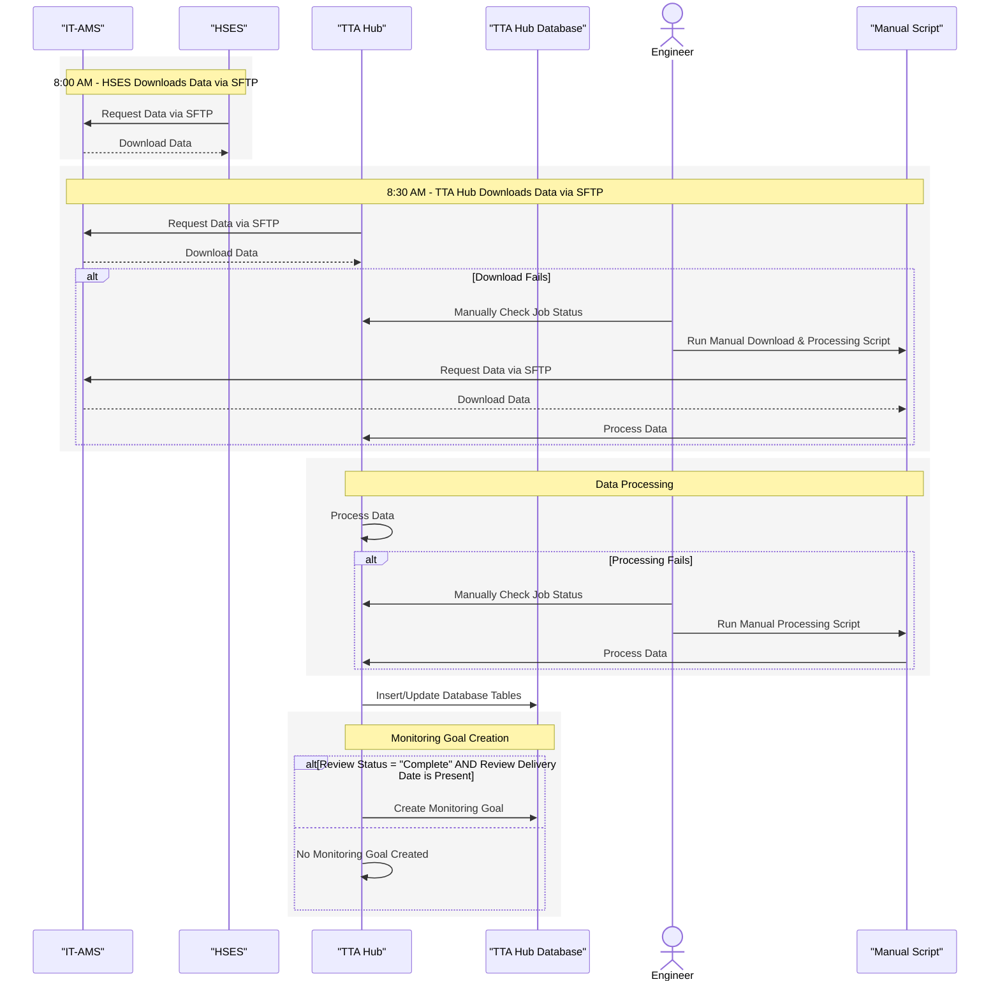

```mermaid
sequenceDiagram
  participant ITAMS as "IT-AMS"
  participant HSES as "HSES"
  participant TTAHub as "TTA Hub"
  participant DB as "TTA Hub Database"
  actor Engineer
  participant ManualScript as "Manual Script"

  rect rgb(245, 245, 245)
    note over ITAMS,HSES: 8:00 AM - HSES Downloads Data via SFTP
    HSES->>ITAMS: Request Data via SFTP
    ITAMS-->>HSES: Download Data
  end

  rect rgb(245, 245, 245)
    note over ITAMS,ManualScript: 8:30 AM - TTA Hub Downloads Data via SFTP
    TTAHub->>ITAMS: Request Data via SFTP
    ITAMS-->>TTAHub: Download Data
    alt Download Fails
      Engineer->>TTAHub: Manually Check Job Status
      Engineer->>ManualScript: Run Manual Download & Processing Script
      ManualScript->>ITAMS: Request Data via SFTP
      ITAMS-->>ManualScript: Download Data
      ManualScript->>TTAHub: Process Data
    end
  end

  rect rgb(245, 245, 245)
    note over TTAHub,ManualScript: Data Processing
    TTAHub->>TTAHub: Process Data
    alt Processing Fails
      Engineer->>TTAHub: Manually Check Job Status
      Engineer->>ManualScript: Run Manual Processing Script
      ManualScript->>TTAHub: Process Data
    end
  end

  TTAHub->>DB: Insert/Update Database Tables

  rect rgb(245, 245, 245)
    note over TTAHub,DB: Monitoring Goal Creation
    alt Review Status = "Complete" AND Review Delivery Date is Present
      TTAHub->>DB: Create Monitoring Goal
    else
      TTAHub->>TTAHub: No Monitoring Goal Created
    end
  end
```
