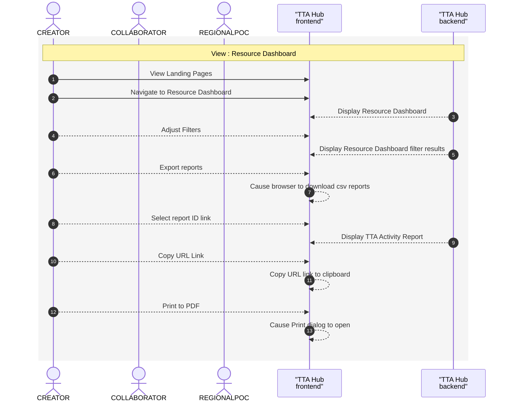

```mermaid
sequenceDiagram
  actor CR as CREATOR
  actor CL as COLLABORATOR
  actor RPOC as REGIONALPOC
  participant FRONTEND as "TTA Hub<br>frontend"
  participant BACKEND as "TTA Hub<br>backend"

  rect rgb(245, 245, 245)
    note over CR,BACKEND: View : Resource Dashboard
    autonumber 1
    CR->>FRONTEND: View Landing Pages
    CR->>FRONTEND: Navigate to Resource Dashboard
    BACKEND-->>FRONTEND: Display Resource Dashboard
    CR-->>FRONTEND: Adjust Filters
    BACKEND-->>FRONTEND: Display Resource Dashboard filter results
    CR-->>FRONTEND: Export reports
    FRONTEND-->>FRONTEND: Cause browser to download csv reports
    CR-->>FRONTEND: Select report ID link
    BACKEND-->>FRONTEND: Display TTA Activity Report
    CR-->>FRONTEND: Copy URL Link
    FRONTEND-->>FRONTEND: Copy URL link to clipboard
    CR-->>FRONTEND: Print to PDF
    FRONTEND-->>FRONTEND: Cause Print dialog to open
  end
```
