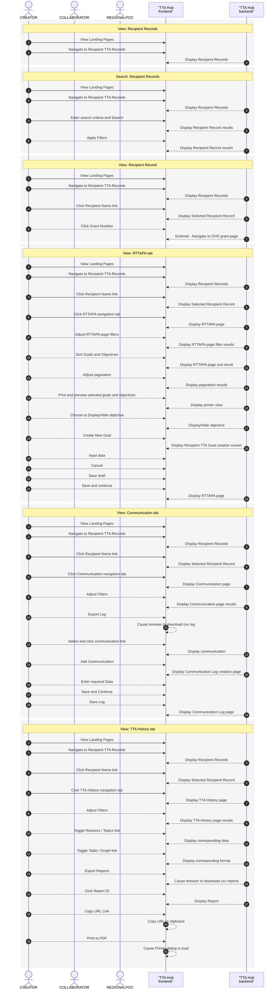

```mermaid
sequenceDiagram
  actor CR as CREATOR
  actor CL as COLLABORATOR
  actor RPOC as REGIONALPOC
  participant FRONTEND as "TTA Hub<br>frontend"
  participant BACKEND as "TTA Hub<br>backend"

  rect rgb(245, 245, 245)
    note over CR,BACKEND: View: Recipient Records
    autonumber 1
    CR->>FRONTEND: View Landing Pages
    CR->>FRONTEND: Navigate to Recipient TTA Records
    BACKEND-->>FRONTEND: Display Recipient Records
  end

  rect rgb(245, 245, 245)
    note over CR,BACKEND: Search: Recipient Records
    autonumber 1
    CR->>FRONTEND: View Landing Pages
    CR->>FRONTEND: Navigate to Recipient TTA Records
    BACKEND-->>FRONTEND: Display Recipient Records
    CR->>FRONTEND: Enter search criteria and Search
    BACKEND-->>FRONTEND: Display Recipient Record results
    CR-->>FRONTEND: Apply Filters
    BACKEND-->>FRONTEND: Display Recipient Record results
  end

  rect rgb(245, 245, 245)
    note over CR,BACKEND: View: Recipient Record
    autonumber 1
    CR->>FRONTEND: View Landing Pages
    CR->>FRONTEND: Navigate to Recipient TTA Records
    BACKEND-->>FRONTEND: Display Recipient Records
    CR->>FRONTEND: Click Recipient Name link
    BACKEND-->>FRONTEND: Display Selected Recipient Record
    CR-->>FRONTEND: Click Grant Number
    BACKEND-->>FRONTEND: External - Navigate to OHS grant page
  end

  rect rgb(245, 245, 245)
    note over CR,BACKEND: View: RTTAPA tab
    autonumber 1
    CR->>FRONTEND: View Landing Pages
    CR->>FRONTEND: Navigate to Recipient TTA Records
    BACKEND-->>FRONTEND: Display Recipient Records
    CR->>FRONTEND: Click Recipient Name link
    BACKEND-->>FRONTEND: Display Selected Recipient Record
    CR->>FRONTEND: Click RTTAPA navigation tab
    BACKEND-->>FRONTEND: Display RTTAPA page
    CR-->>FRONTEND: Adjust RTTAPA page filters
    BACKEND-->>FRONTEND: Display RTTAPA page filter results
    CR-->>FRONTEND: Sort Goals and Objectives
    BACKEND-->>FRONTEND: Display RTTAPA page sort result
    CR-->>FRONTEND: Adjust pagination
    BACKEND-->>FRONTEND: Display pagination results
    CR-->>FRONTEND: Print and preview selected goals and objectives
    BACKEND-->>FRONTEND: Display printer view
    CR-->>FRONTEND: Choose to Display/Hide objective
    BACKEND-->>FRONTEND: Display/Hide objective
    CR-->>FRONTEND: Create New Goal
    BACKEND-->>FRONTEND: Display Recipient TTA Goal creation screen
    CR-->>FRONTEND: Input data
    CR-->>FRONTEND: Cancel
    CR-->>FRONTEND: Save draft
    CR-->>FRONTEND: Save and continue
    BACKEND-->>FRONTEND: Display RTTAPA page
  end

  rect rgb(245, 245, 245)
    note over CR,BACKEND: View: Communication tab
    autonumber 1
    CR->>FRONTEND: View Landing Pages
    CR->>FRONTEND: Navigate to Recipient TTA Records
    BACKEND-->>FRONTEND: Display Recipient Records
    CR->>FRONTEND: Click Recipient Name link
    BACKEND-->>FRONTEND: Display Selected Recipient Record
    CR->>FRONTEND: Click Communication navigation tab
    BACKEND-->>FRONTEND: Display Communication page
    CR-->>FRONTEND: Adjust Filters
    BACKEND-->>FRONTEND: Display Communication page results
    CR-->>FRONTEND: Export Log
    FRONTEND-->>FRONTEND: Cause browser to download csv log
    CR-->>FRONTEND: Select and click communication link
    BACKEND-->>FRONTEND: Display communication
    CR-->>FRONTEND: Add Communication
    BACKEND-->>FRONTEND: Display Communication Log creation page
    CR-->>FRONTEND: Enter required Data
    CR-->>FRONTEND: Save and Continue
    CR-->>FRONTEND: Save Log
    BACKEND-->>FRONTEND: Display Communication Log page
  end

  rect rgb(245, 245, 245)
    note over CR,BACKEND: View: TTA History tab
    autonumber 1
    CR->>FRONTEND: View Landing Pages
    CR->>FRONTEND: Navigate to Recipient TTA Records
    BACKEND-->>FRONTEND: Display Recipient Records
    CR->>FRONTEND: Click Recipient Name link
    BACKEND-->>FRONTEND: Display Selected Recipient Record
    CR->>FRONTEND: Click TTA History navigation tab
    BACKEND-->>FRONTEND: Display TTA History page
    CR-->>FRONTEND: Adjust Filters
    BACKEND-->>FRONTEND: Display TTA History page results
    CR-->>FRONTEND: Toggle Reasons / Topics link
    BACKEND-->>FRONTEND: Display corresponding data
    CR-->>FRONTEND: Toggle Table / Graph link
    BACKEND-->>FRONTEND: Display corresponding format
    CR-->>FRONTEND: Export Reports
    BACKEND-->>FRONTEND: Cause browser to download csv reports
    CR-->>FRONTEND: Click Report ID
    BACKEND-->>FRONTEND: Display Report
    CR-->>FRONTEND: Copy URL Link
    FRONTEND-->>FRONTEND: Copy URL to clipboard
    CR-->>FRONTEND: Print to PDF
    FRONTEND-->>FRONTEND: Cause Printer dialog to load
  end
```
