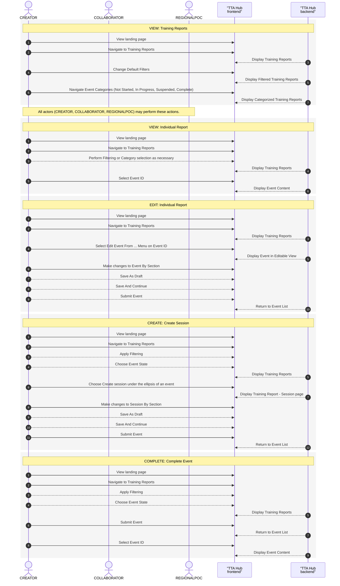

```mermaid
sequenceDiagram
  actor CR as CREATOR
  actor CL as COLLABORATOR
  actor RPOC as REGIONALPOC
  participant FRONTEND as "TTA Hub<br>frontend"
  participant BACKEND as "TTA Hub<br>backend"

  rect rgb(245, 245, 245)
    note over CR,BACKEND: VIEW: Training Reports
    autonumber 1
    CR->>FRONTEND: View landing page
    CR->>FRONTEND: Navigate to Training Reports
    BACKEND-->>FRONTEND: Display Training Reports
    CR->>FRONTEND: Change Default Filters
    BACKEND-->>FRONTEND: Display Filtered Training Reports
    CR->>FRONTEND: Navigate Event Categories (Not Started, In Progress, Suspended, Complete)
    BACKEND-->>FRONTEND: Display Categorized Training Reports
  end

  note over CR,RPOC: All actors (CREATOR, COLLABORATOR, REGIONALPOC) may perform these actions.

  rect rgb(245, 245, 245)
    note over CR,BACKEND: VIEW: Individual Report
    autonumber 1
    CR->>FRONTEND: View landing page
    CR->>FRONTEND: Navigate to Training Reports
    CR-->>FRONTEND: Perform Filtering or Category selection as necessary
    BACKEND-->>FRONTEND: Display Training Reports
    CR->>FRONTEND: Select Event ID
    BACKEND-->>FRONTEND: Display Event Content
  end

  rect rgb(245, 245, 245)
    note over CR,BACKEND: EDIT: Individual Report
    autonumber 1
    CR->>FRONTEND: View landing page
    CR->>FRONTEND: Navigate to Training Reports
    BACKEND-->>FRONTEND: Display Training Reports
    CR->>FRONTEND: Select Edit Event From ... Menu on Event ID
    BACKEND-->>FRONTEND: Display Event in Editable View
    CR->>FRONTEND: Make changes to Event By Section
    CR-->>FRONTEND: Save As Draft
    CR-->>FRONTEND: Save And Continue
    CR-->>FRONTEND: Submit Event
    BACKEND-->>FRONTEND: Return to Event List
  end

  rect rgb(245, 245, 245)
    note over CR,BACKEND: CREATE: Create Session
    autonumber 1
    CR->>FRONTEND: View landing page
    CR->>FRONTEND: Navigate to Training Reports
    CR-->>FRONTEND: Apply Filtering
    CR-->>FRONTEND: Choose Event State
    BACKEND-->>FRONTEND: Display Training Reports
    CR->>FRONTEND: Choose Create session under the ellipsis of an event
    BACKEND-->>FRONTEND: Display Training Report - Session page
    CR->>FRONTEND: Make changes to Session By Section
    CR-->>FRONTEND: Save As Draft
    CR-->>FRONTEND: Save And Continue
    CR->>FRONTEND: Submit Event
    BACKEND-->>FRONTEND: Return to Event List
  end

  rect rgb(245, 245, 245)
    note over CR,BACKEND: COMPLETE: Complete Event
    autonumber 1
    CR->>FRONTEND: View landing page
    CR->>FRONTEND: Navigate to Training Reports
    CR-->>FRONTEND: Apply Filtering
    CR-->>FRONTEND: Choose Event State
    BACKEND-->>FRONTEND: Display Training Reports
    CR->>FRONTEND: Submit Event
    BACKEND-->>FRONTEND: Return to Event List
    CR->>FRONTEND: Select Event ID
    BACKEND-->>FRONTEND: Display Event Content
  end
```
