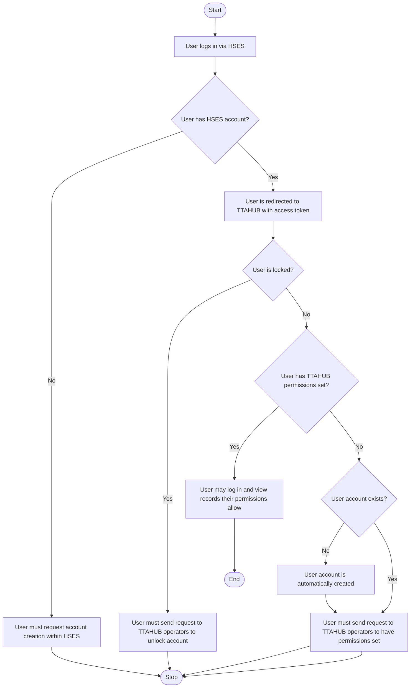
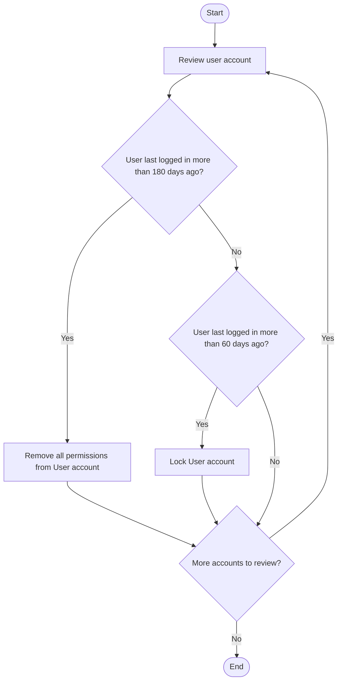
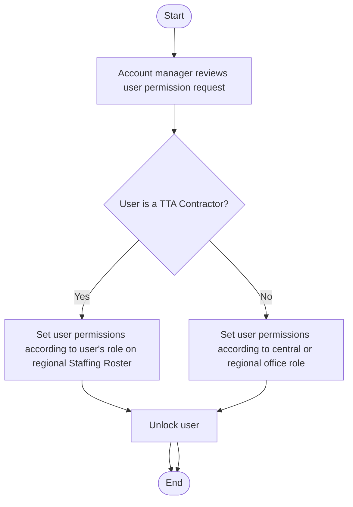

Workflow Diagrams
=================

Collection of various workflows and processes present in the TTA Smart Hub application.

Account Creation
----------------

Account Termination
-------------------

Setting Permissions
-------------------

